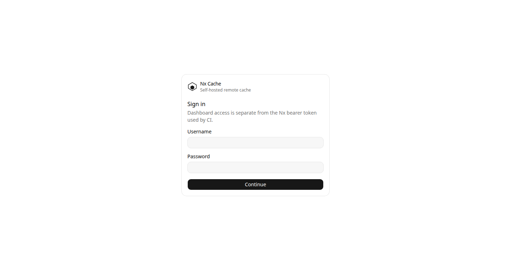
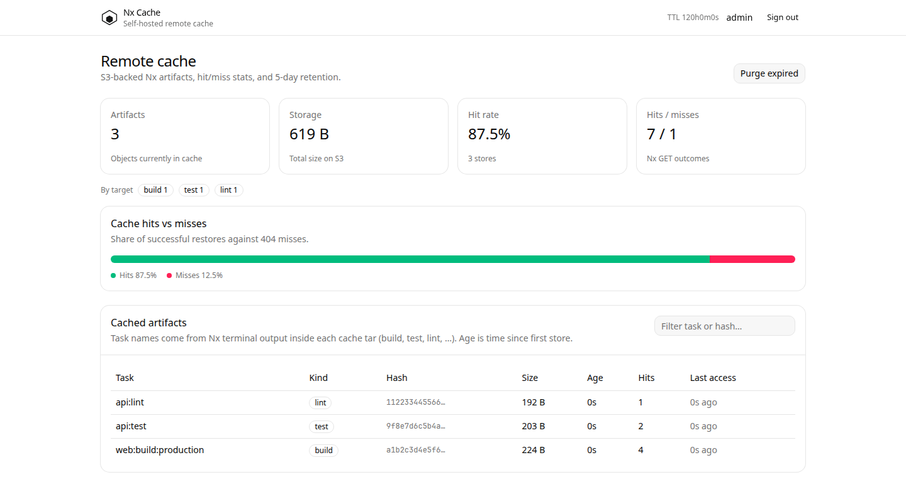

# Nx Cache

Self-hosted [Nx remote cache](https://nx.dev/docs/kb/self-hosted-caching) server. Artifacts live in S3 (or any S3-compatible store such as [RustFS](https://rustfs.com) or MinIO). The HTTP API follows the Nx OpenAPI spec. A small dashboard shows what is cached, how old it is, and hit/miss counts.

Inspired by [IKatsuba/nx-cache-server](https://github.com/IKatsuba/nx-cache-server), implemented in Go with Chi.

**SQLite is not required.** By default the catalog and hit/miss counters are JSON objects in the same bucket (`{prefix}.meta/`). Set `CATALOG_BACKEND=sqlite` only if you want a local index.

License: [MIT](LICENSE).





## Features

- `PUT` / `GET` / `HEAD` `/v1/cache/{hash}` with bearer auth
- S3 or S3-compatible storage (AWS, RustFS, MinIO, Cloudflare R2, …)
- Does not overwrite existing hashes (`409`)
- Requires `Content-Length` (`411`); truncated uploads are discarded
- Optional read-only token (`403` on write)
- Artifacts older than **5 days** are deleted by a background job **and** after a successful save
- Dashboard (templ + HTMX + Tailwind + [shadcn-templ](https://github.com/axadrn/shadcn-templ)) with session login
- Infers **project:target** (build / test / lint / …) from the Nx tar's `terminalOutput` — the OpenAPI PUT only sends a content hash

## Quick start

Published image (after the `image` workflow has run on `main`):

```bash
docker pull ghcr.io/nimbit-platform/nx-cache:latest
docker run --rm -p 8080:8080 \
  -e NX_CACHE_ACCESS_TOKEN=dev-token \
  -e UI_USERNAME=admin \
  -e UI_PASSWORD=choose-a-password \
  -e SESSION_SECRET=choose-a-secret \
  -e SESSION_SECURE=false \
  -e AWS_REGION=us-east-1 \
  -e AWS_ACCESS_KEY_ID=... \
  -e AWS_SECRET_ACCESS_KEY=... \
  -e S3_BUCKET_NAME=nx-cache \
  -e S3_ENDPOINT_URL=https://s3.amazonaws.com \
  -e CATALOG_BACKEND=s3 \
  ghcr.io/nimbit-platform/nx-cache:latest
```

Local RustFS stack:

RustFS starts with no buckets. You do **not** need a separate create-bucket image or init container: compose sets `S3_CREATE_BUCKET=true`, and the cache process creates `S3_BUCKET_NAME` on boot (`HeadBucket` then `CreateBucket`). The e2e suite does the same via `EnsureBucket`.

Copy `.env.example` to `.env` and set `NX_CACHE_ACCESS_TOKEN`, `UI_PASSWORD`, and `SESSION_SECRET`. Compose binds to `127.0.0.1` and refuses to start without those values.

```bash
cp .env.example .env
# edit UI_PASSWORD / tokens
docker compose up --build
```

- Cache API: `http://localhost:8080`
- UI: `http://localhost:8080/login`
- RustFS console: `http://localhost:9001`

## Passwords and tokens

There is no in-app account database. Credentials are environment variables read at process start. Change a value, then restart the container/process.

| Who | Variables | How to set / change |
| --- | --- | --- |
| Dashboard login | `UI_USERNAME` (default `admin`), `UI_PASSWORD` (**required**) | Set in compose, Kubernetes secret, or `-e`. Restart to apply. |
| Cookie signing | `SESSION_SECRET` | Set a long random string. If unset, a random secret is generated and sessions will not survive a restart. Changing it signs everyone out. |
| Nx CLI (read/write) | `NX_CACHE_ACCESS_TOKEN` | Same value as `NX_SELF_HOSTED_REMOTE_CACHE_ACCESS_TOKEN` on the Nx client. |
| Nx CLI (read only) | `NX_CACHE_READ_TOKEN` | Optional. `GET` works, `PUT` returns `403`. |

Example:

```bash
export UI_USERNAME=admin
export UI_PASSWORD='your-new-password'
export SESSION_SECRET='a-long-random-string'
export NX_CACHE_ACCESS_TOKEN='nx-bearer-token'
```

Do not commit real passwords. Use `.env` (gitignored) or your orchestrator's secrets.

## Configuration

All settings are environment variables. Also listed in `.env.example`.

| Variable | Default | Purpose |
| --- | --- | --- |
| `PORT` | `8080` | Listen port |
| `LOG_LEVEL` | `info` | `debug`, `info`, `warn`, `error` (`warning` is accepted as `warn`) |
| `LOG_FORMAT` | `text` | `text` or `json` (structured `log/slog`; JSON recommended in production) |
| `NX_CACHE_ACCESS_TOKEN` | required | Bearer token for Nx (read + write) |
| `NX_CACHE_READ_TOKEN` | empty | Optional read-only bearer token |
| `UI_USERNAME` | `admin` | Dashboard login |
| `UI_PASSWORD` | required | Dashboard password |
| `SESSION_SECRET` | random ephemeral | Cookie signing secret. Set this in production. |
| `SESSION_SECURE` | `true` | Session cookies require HTTPS. Set `false` for local HTTP. |
| `TRUST_FORWARDED_IP` | `false` | Trust `X-Forwarded-For` / `X-Real-IP` only behind a known proxy. |
| `ALLOW_IPS` | empty | Optional comma-separated IPs/CIDRs (for example `10.0.0.0/8,192.168.1.4`). Empty = any client. `/health` is always allowed. |
| `RATE_LIMIT_RPS` | `0` | Per-IP request rate (token bucket). `0` disables. `/health` is not limited. |
| `RATE_LIMIT_BURST` | `0` | Extra tokens above `RATE_LIMIT_RPS`. Defaults to the RPS value when unset. |
| `AWS_REGION` | `us-east-1` | S3 region |
| `AWS_ACCESS_KEY_ID` / `AWS_SECRET_ACCESS_KEY` | default chain | Leave empty to use instance role / IRSA |
| `S3_BUCKET_NAME` | `nx-cache` | Bucket for artifacts **and** catalog JSON |
| `S3_ENDPOINT_URL` | empty | Set for RustFS / MinIO / R2 |
| `S3_PREFIX` | `nx-cache/` | Object key prefix |
| `S3_FORCE_PATH_STYLE` | true when endpoint set | Path-style S3 |
| `S3_CREATE_BUCKET` | `false` | Create the bucket on boot |
| `STORAGE_BACKEND` | `s3` | `s3` or `memory` (dev only, not durable) |
| `CATALOG_BACKEND` | `s3` | `s3` (same bucket, no extra DB) or `sqlite` |
| `CATALOG_FLUSH_INTERVAL` | `30s` | How often the in-memory catalog/stats snapshot is written to S3. `0` disables the timer (still flushes on shutdown). |
| `SQLITE_PATH` | unset | Only used when `CATALOG_BACKEND=sqlite` (then defaults to `data/nx-cache.db`; the Docker image sets `/data/nx-cache.db`) |
| `CACHE_TTL` | `120h` | Delete artifacts whose **create time** is older than this (not last access) |
| `CLEANUP_INTERVAL` | `1h` | Background cleanup cadence |
| `CLEANUP_ON_SAVE` | `true` | Also purge expired objects after `PUT` |
| `MAX_UPLOAD_BYTES` | `2GiB` | Reject larger uploads |

With `CATALOG_BACKEND=s3`, hits/misses and per-hash metadata are kept in memory and flushed as one snapshot to `{S3_PREFIX}.meta/catalog.json` every `CATALOG_FLUSH_INTERVAL` (and again on shutdown). Artifact `PUT`/`GET` still go to S3 immediately.

**Run a single replica** against a given bucket prefix. The snapshot is last-writer-wins; two processes will overwrite each other's counters and task metadata. Use SQLite (local disk) or an external store if you need more than one process.

Dashboard reads come from that in-memory catalog, not a full S3 listing. A background reconcile on startup (and TTL cleanup) still walks the bucket.

## API

Matches the [Nx self-hosted cache spec](https://nx.dev/docs/kb/self-hosted-caching):

- `PUT /v1/cache/{hash}` — upload a task output (`Content-Length` required)
- `GET /v1/cache/{hash}` — download a task output (`application/octet-stream`)
- `HEAD /v1/cache/{hash}` — existence check
- `GET /health` — liveness

Authorization: `Authorization: Bearer <token>`.

## Testing

An Nx workspace is **not** required to verify this server. Nx only speaks `PUT` / `GET` / `HEAD` `/v1/cache/{hash}` with a bearer token and an `application/octet-stream` body. Controller tests and the RustFS e2e suite send that same protocol.

Nx does **not** send the task name on the wire. Each payload is a gzip tar of the local cache dir, including `terminalOutput` (typically `> nx run web:build`). The dashboard parses that (and output paths) to show **Task** and **Kind** (build, test, lint, e2e, typecheck). Optional headers `X-Nx-Project`, `X-Nx-Target`, and `X-Nx-Configuration` override inference if a wrapper sets them.

```bash
make test          # unit + HTTP controller tests with the race detector
make e2e           # Nx OpenAPI contract against real RustFS
make screenshots   # Chrome captures of /login and the dashboard → docs/screenshots/ (needs -tags screenshot)
```

`make e2e` skips if nothing is listening on `S3_ENDPOINT_URL` (default `http://127.0.0.1:9000`). To fail instead of skip:

```bash
docker compose up -d rustfs
E2E_REQUIRE_RUSTFS=1 make e2e
```

Default RustFS credentials match compose: access key `nxcache`, secret `nxcache-e2e-secret-key`, bucket `nx-cache-e2e`.

Optional: point a real Nx workspace at a running server.

```bash
export NX_SELF_HOSTED_REMOTE_CACHE_SERVER=http://localhost:8080
export NX_SELF_HOSTED_REMOTE_CACHE_ACCESS_TOKEN=dev-token
npx nx run-many -t build
```

CI (`test` workflow) runs unit/controller tests on every PR, plus an `e2e` job with a RustFS service container.

## GitHub Actions / GHCR

The container is published to **this repository’s GitHub Packages** (GitHub Container Registry), not Docker Hub:

[ghcr.io/nimbit-platform/nx-cache](https://github.com/nimbit-platform/nx-cache/pkgs/container/nx-cache)

Public packages are free. The workflow marks the package public after each push. `latest` is only moved on `main`; `v*` tags publish semver; same-repo PRs publish `sha-*` and `pr-*` tags.

- `test` workflow: unit tests and RustFS e2e on push and pull request
- `image` workflow: multi-arch (`linux/amd64`, `linux/arm64`) scratch image, GitHub Actions layer cache, then push to that package

The runtime image is `scratch` (static binary, CA certs, zoneinfo). Builds compile CSS and Go on the builder CPU and cross-compile to the target arch so arm64 is not QEMU’d. `HEALTHCHECK` runs `nx-cache healthcheck`.

Pull (no login when the package is public):

```bash
docker pull ghcr.io/nimbit-platform/nx-cache:latest
```

## Development

Requires Go 1.27+ and [templ](https://templ.guide).

```bash
go install github.com/a-h/templ/cmd/templ@v0.3.943
npm install
make test
make screenshots
make build
```
